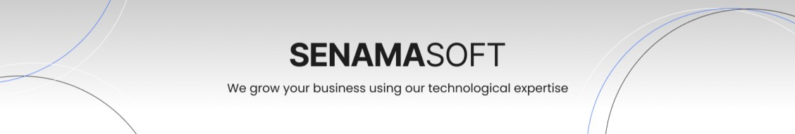
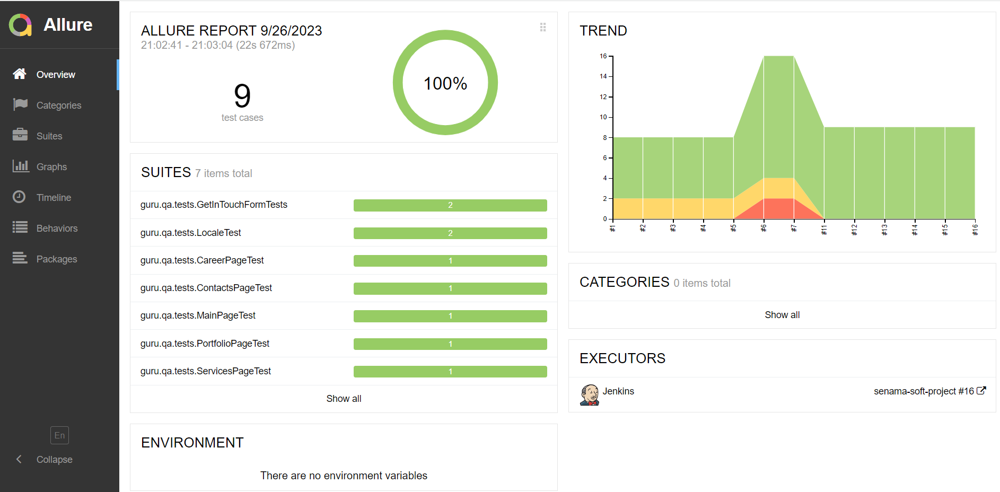
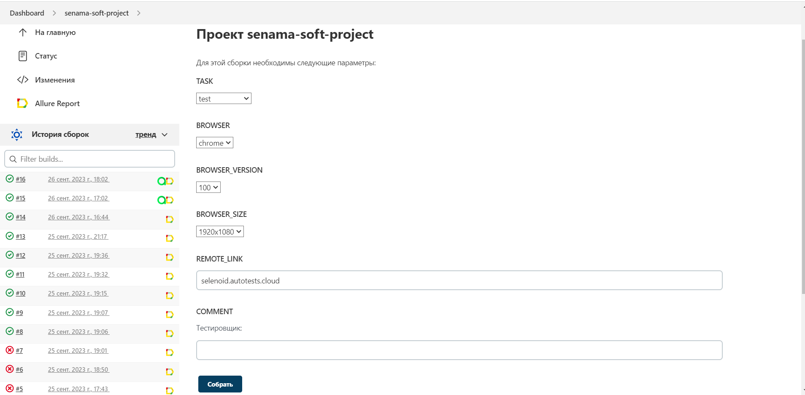
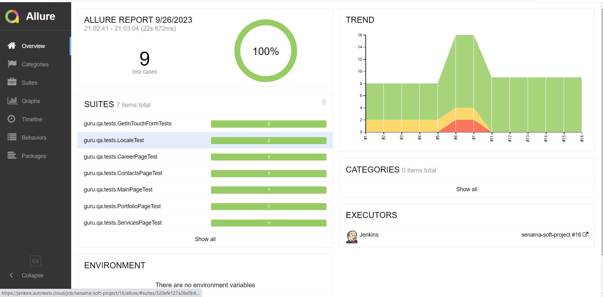
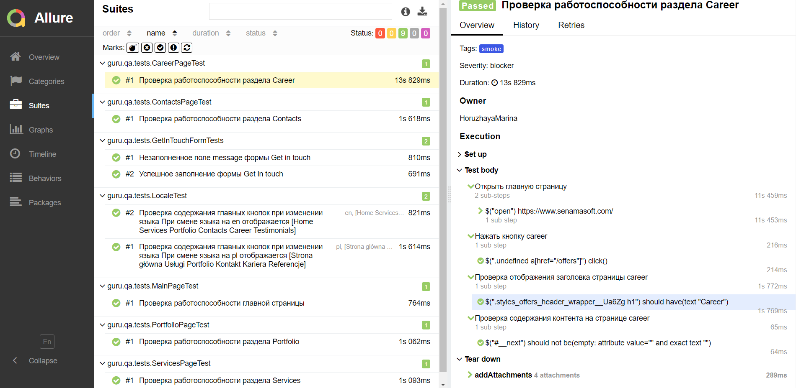
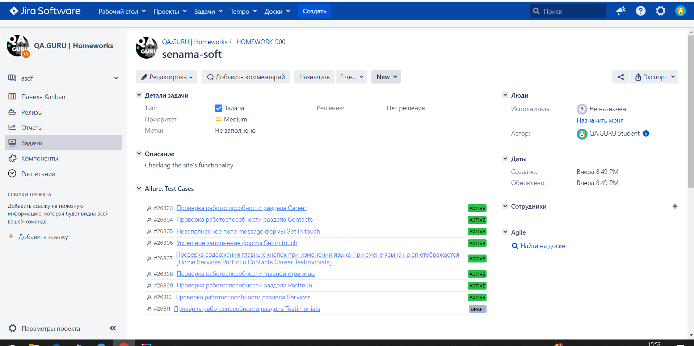
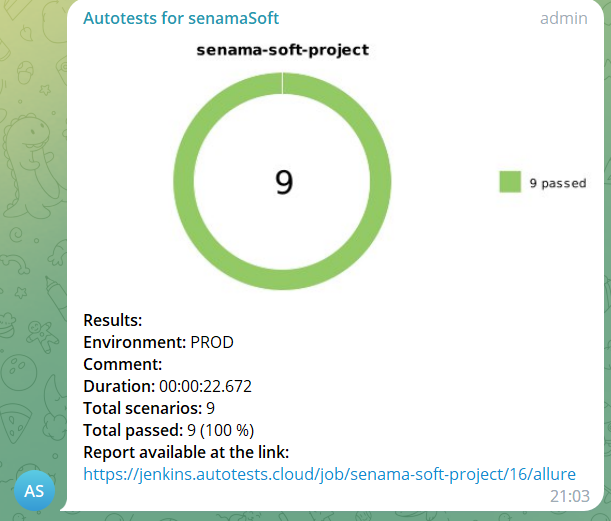
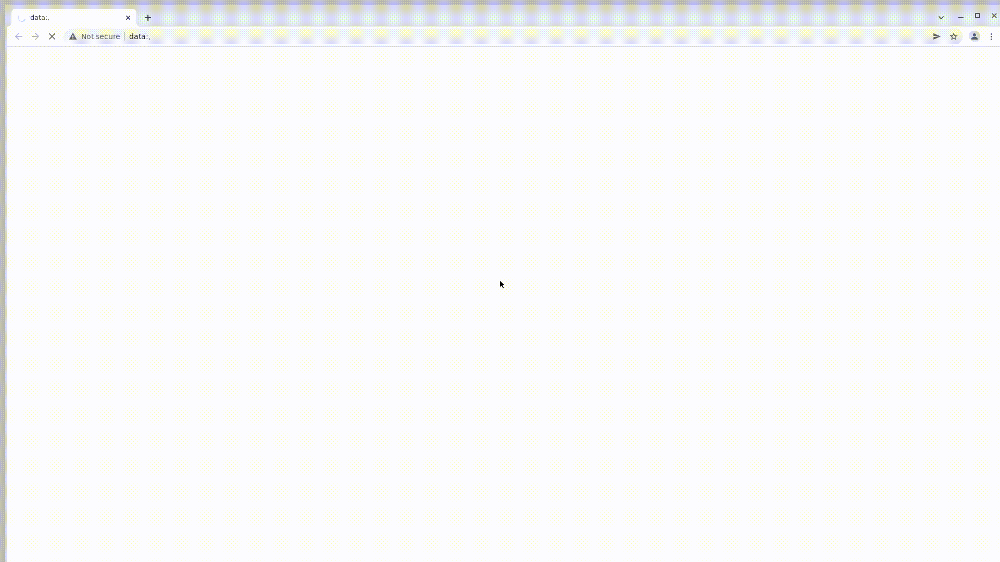

<p align="center">
<a href="https://www.senamasoft.com/">  </a></h1>
<p align="center">

# <p align="center"> Проект по автоматизации тестовых сценариев для  SenamaSoft <p align="center">

## Использованный стек технологий
<p align="center">





</p>

## Cодержание:
- Стек технологий
- Тестовые сценарии
- Сборка в Jenkins
- Команда для запуска тестов в терминале
- Allure отчет
- Интеграция с Allure TestOps
- Интеграция с Jira
- Уведомления в Telegram чат с ботом
- Видео запуска тестов в Selenoid

## Тестовые сценарии:
- Проверка работоспособности главной страницы
- Проверка работоспособности разделов: Services, Portfolio, Contacts, Career, Testimonials
- Проверка содержания главных кнопок при изменении языка
- Успешное заполнение формы Get in touch
- Неуспешное заполнение формы Get in touch

##  Сборка в [Jenkins](https://jenkins.autotests.cloud/job/senama-soft-project/)


<p align="center">  
</a>  
</p>

## 📋 Параметры сборки в Jenkins:

- _REMOTE_LINK (URL Selenoid, по умолчанию selenoid.autotests.cloud)_
- _TASK (Задачи, по умолчанию test)_
- _BROWSER (Браузер, по умолчанию chrome)_
- _BROWSER_VERSION (Версия браузера, по умолчанию 100.0)_
- _BROWSER_SIZE (Размер окна браузера, по умолчанию 1920x1080)_

### Запуск тестов с параметрами в **Jenkins**

<p align="center">

</p>

---
## Команда для запуска

```
clean
${TASK}
-Dbrowser=${BROWSER}
-DbrowserVersion=${BROWSER_VERSION}
-DbrowserSize=${BROWSER_SIZE}
-DremoteLink=https://user1:1234@${REMOTE_LINK}/wd/hub
```

---

##  [Allure](https://jenkins.autotests.cloud/job/senama-soft-project/16/allure/) отчет

### Главная страница отчета 

<p align="center">

</p>

### Тест-кейсы

<p align="center">

</p>

####  Содержание тест-кейсов 

- Подробное описание шагов
- Тег
- Критичность теста
- Автор
- Послдений скриншот для каждого теста 
- HTML разметка страницы
- Логи браузера 
- Видео с прохождением теста

---

##  Интеграция с [AllureTestOps](https://allure.autotests.cloud/project/3690/dashboards)

### Dashboard

<p align="center">

</p>

### Ручные и автоматизированные тест-кейсы

<p align="center">

</p>

##  Интеграция с [Jira](https://jira.autotests.cloud/browse/HOMEWORK-900)

<p align="center">

</p>

---

##  Уведомление в Telegram чат при помощи бота

### Уведомление из переписки с чат ботом

<p align="center">

</p>

---

##  Видео запусков теста в Selenoid

<p align="center">

</p>


